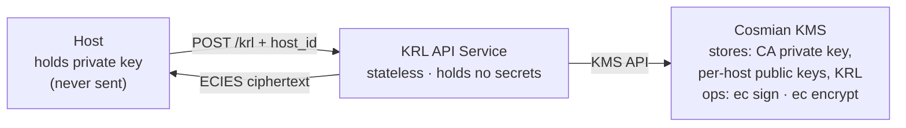
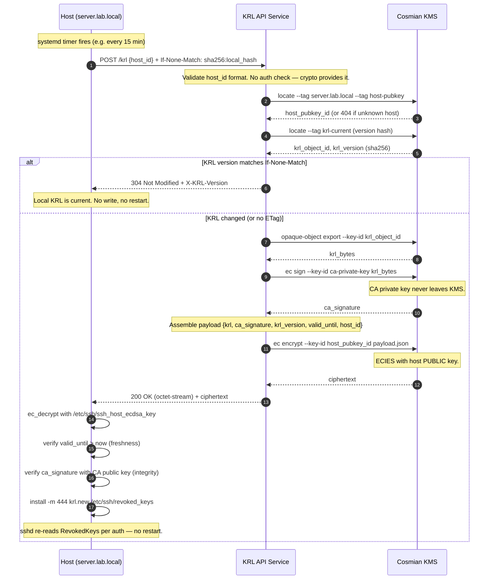

# 1. Concept

A lightweight REST service delivers per-host encrypted KRL payloads over HTTPS.
The service carries **no application-level authentication or authorisation**.
Security is layered as follows:

| Layer | Mechanism | What it provides |
|---|---|---|
| Transport | HTTPS (TLS) | Confidentiality and integrity of the HTTP exchange |
| Payload | ECIES (host public key) | Only the target host can decrypt its KRL |
| Payload integrity | ECDSA signature (CA private key) | KRL is authentic even if the distribution service is compromised |
| Freshness | `valid_until` inside ciphertext | Prevents replay of old encrypted responses |

A host that cannot decrypt the payload cannot use it. Decryption success is
implicit proof of identity.

# 2. Cryptographic Direction

ECIES (Elliptic Curve Integrated Encryption Scheme) runs in the **opposite**
direction from signing:

| Operation | Key used | Who can perform it |
|---|---|---|
| Encrypt | recipient's **public** key | anyone — performed server-side |
| Decrypt | recipient's **private** key | only the key holder — performed on the host |

For payload confidentiality — ensuring only the target host can read its KRL —
the server encrypts with the host's **public** key. The host's **private** key
(`/etc/ssh/ssh_host_ecdsa_key`) never leaves the host.

Separately, the CA **signs** the KRL (private key → signature) and the host
**verifies** that signature (public key → ok/fail). That is the integrity layer,
independent of the confidentiality layer above.

# 3. Components



*Figure 1 — KRL distribution components*

- **KRL API Service** — a stateless HTTP process. Holds no secrets; every
  cryptographic operation is delegated to Cosmian KMS via its API.
- **Cosmian KMS** — the only process that touches key material. It performs
  signing and encryption without ever exposing private-key bytes. It stores the
  CA private key, the per-host public keys (tagged by hostname), and the KRL as
  an opaque object.
- **Host** — owns `/etc/ssh/ssh_host_ecdsa_key` (nistp256). This private key
  never traverses the network at any point in the protocol.

# 4. Host Public Key Registration

At host-certificate issuance time, the host's ECDSA public key is also imported
into the KMS, tagged with the hostname. This piggybacks on the existing signing
workflow with no additional ceremony.

```bash
# On the CA operator / Ansible controller, at cert-issuance time:
cosmian kms ec keys import \
  --key-format pkcs8-pem \
  --tag host-pubkey \
  --tag server.lab.local \
  /tmp/ssh_host_ecdsa_key.pub
```

The KRL itself is stored as an opaque object in the KMS, updated by the CA
operator whenever a key is revoked:

```bash
cosmian kms opaque-object create \
  --tag krl \
  --tag krl-current \
  /etc/ssh/revoked_keys
```

# 5. Protocol Sequence



*Figure 2 — KRL pull protocol (304 / 200)*

The host runs a systemd timer (for example, every 15 minutes) that issues a
`POST /krl`. The service validates only the `host_id` format — there is no auth
check, because the cryptography provides it. It locates the host's public key
(unknown host → `404`), compares the current KRL version against the client's
`If-None-Match`, and either returns `304 Not Modified` or signs and ECIES-encrypts
the KRL and returns `200`. The host then decrypts with its own private key,
verifies freshness and the CA signature, and atomically installs the new KRL.

# 6. Data Flow Detail

## Request (host → API service)

```http
POST /krl HTTP/1.1
Host:          krl.internal
Content-Type:  application/json
If-None-Match: sha256:4d3f1a...   ← sha256 of local /etc/ssh/revoked_keys

{"host_id": "server.lab.local"}
```

`host_id` is in the **body**, not the URL path, so it does not appear in:

- HTTP access logs (which typically record only method + path)
- CDN or reverse-proxy caches
- Browser history or `curl` verbose output

## Response (304 — already current)

```http
HTTP/1.1 304 Not Modified
X-KRL-Version: sha256:4d3f1a...
```

No payload. The host skips the file write and KMS work is minimal (only the
version lookup runs).

## Response (200 — new KRL available)

```http
HTTP/1.1 200 OK
Content-Type:   application/octet-stream
X-KRL-Version:  sha256:9b7c2e...
Content-Length: <N>

<binary ECIES ciphertext>
```

## Inner plaintext payload (visible only after host decryption)

```json
{
  "krl":          "<base64-encoded KRL bytes>",
  "ca_signature": "<base64-encoded ECDSA-SHA256 signature>",
  "krl_version":  "sha256:9b7c2e...",
  "valid_until":  1744292400,
  "host_id":      "server.lab.local"
}
```

`host_id` inside the ciphertext binds the payload to the intended recipient. A
host that somehow obtained another host's ciphertext would decrypt successfully
(with that host's key) but see a `host_id` that does not match — detecting
misdirected payloads.

# 7. Security Properties

| Property | How it is achieved |
|---|---|
| KRL readable only by target host | ECIES: encrypted with the host's public key; only the private-key holder can decrypt |
| KRL authenticity | CA ECDSA signature over the KRL bytes, verified by the host using the CA public key |
| Replay prevention | `valid_until` timestamp inside the ciphertext; the host rejects it if expired |
| No secret on API service | The API service holds no keys; all crypto is delegated to KMS |
| CA private key never exposed | Signing happens inside KMS; key material is never returned to the caller |
| Host private key never sent | Decryption happens on the host using its local key; KMS holds only the public key |
| Transport security | HTTPS; assumed present, not re-implemented |
| No sshd disruption | `sshd` re-reads `RevokedKeys` on every authentication attempt; no restart needed |

# 8. What This Does Not Protect Against

- **Compromised host private key** — an attacker with the host's ECDSA private
  key can fetch and decrypt that host's KRL, but gains nothing beyond what was
  already revoked.
- **A host that never calls the endpoint** — pull-based distribution has no
  enforcement. A host that is down or network-isolated will not receive updates
  until it reconnects. Complement this with a short certificate TTL as the
  primary revocation mechanism; the KRL is the emergency path.
- **KRL service availability** — if the service is unreachable, the host retains
  its last-known KRL. This is safe (the KRL only grows; an old KRL is a subset of
  the current one) but means new revocations are delayed.
- **Hostname spoofing in the request body** — a host can claim to be any
  `host_id`. The service encrypts the KRL for that host's registered public key,
  so the requester receives a ciphertext it cannot decrypt (wrong private key).
  There is no information disclosure beyond confirming whether a `host_id` is
  registered (`404` vs `200`).

# 9. KMS Operations Summary

| Step | KMS call | Key used | Direction |
|---|---|---|---|
| Locate host pubkey | `locate --tag <hostname> --tag host-pubkey` | — | lookup only |
| Retrieve KRL | `opaque-object export` | — | retrieve only |
| Sign KRL | `ec sign --key-id ca-private-key` | CA **private** key | private → signature |
| Encrypt payload | `ec encrypt --key-id <host-pubkey-id>` | host **public** key | public → ciphertext |

All four operations run server-side inside KMS. The host performs only:

- `ec decrypt` (local, using `/etc/ssh/ssh_host_ecdsa_key`)
- ECDSA signature verification (local, using the CA public key)
