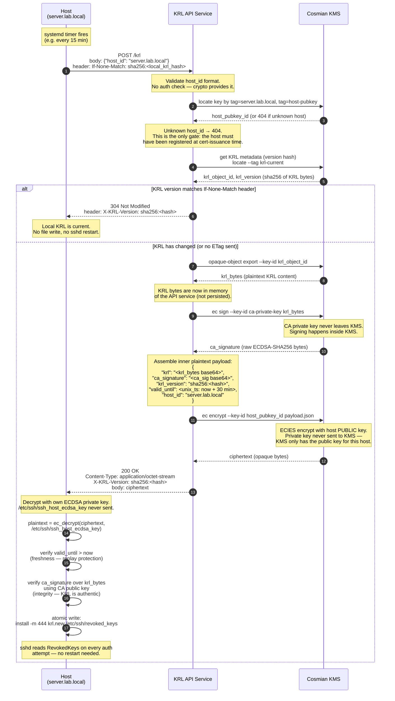

# KRL Distribution — Encrypted REST API Design

## Concept

A lightweight REST service delivers per-host encrypted KRL payloads over HTTPS.
The service carries **no application-level authentication or authorisation**.
Security is layered as follows:

| Layer | Mechanism | What it provides |
|---|---|---|
| Transport | HTTPS (TLS) | Confidentiality and integrity of the HTTP exchange |
| Payload | ECIES (host public key) | Only the target host can decrypt its KRL |
| Payload integrity | ECDSA signature (CA private key) | KRL is authentic even if the distribution service is compromised |
| Freshness | `valid_until` inside ciphertext | Prevents replay of old encrypted responses |

A host that cannot decrypt the payload cannot use it.
Decryption success is implicit proof of identity.

---

## Cryptographic Direction — Important Clarification

ECIES (Elliptic Curve Integrated Encryption Scheme) works as follows:

```
Encrypt:  PUBLIC key  → ciphertext   (server side, anyone can encrypt)
Decrypt:  PRIVATE key ← ciphertext   (host side, only key holder can decrypt)
```

This is the **opposite** of signing (where the private key produces a value the
public key can verify). For payload confidentiality — ensuring only the target
host can read the KRL — the server must encrypt with the host's **public** key.
The host's **private** key (`/etc/ssh/ssh_host_ecdsa_key`) never leaves the host.

Separately, the CA **signs** the KRL (private key → signature) and the host
**verifies** that signature (public key → ok/fail). This is the integrity layer.

---

## Components

```
┌─────────────────────────────────────────────────────────────────────┐
│                                                                     │
│   ┌──────────────┐      HTTPS       ┌──────────────────────┐       │
│   │    Host      │ ───────────────► │  KRL API Service     │       │
│   │              │ ◄─────────────── │  (stateless HTTP)    │       │
│   │  private key │   ciphertext     └──────────┬───────────┘       │
│   │  (on disk,   │                             │ KMS API            │
│   │  never sent) │                  ┌──────────▼───────────┐       │
│   └──────────────┘                  │   Cosmian KMS        │       │
│                                     │                      │       │
│                                     │  Stores:             │       │
│                                     │  ① CA private key   │       │
│                                     │  ② Host public keys │       │
│                                     │     (per hostname)   │       │
│                                     │  ③ KRL (opaque obj) │       │
│                                     │                      │       │
│                                     │  Operations:         │       │
│                                     │  · ec sign (ECDSA)  │       │
│                                     │  · ec encrypt (ECIES)│       │
│                                     └──────────────────────┘       │
└─────────────────────────────────────────────────────────────────────┘
```

**KRL API Service** — stateless HTTP process. Holds no secrets. All
cryptographic operations are delegated to Cosmian KMS via its API.

**Cosmian KMS** — the only process that touches key material. Performs
signing and encryption without ever exposing private key bytes.

**Host** — owns `/etc/ssh/ssh_host_ecdsa_key` (nistp256). This private
key never traverses the network at any point in the protocol.

---

## Prerequisite — Host Public Key Registration

At host certificate issuance time, the host's ECDSA public key is also
imported into the KMS, tagged with the hostname. This piggybacks on the
existing signing workflow with no additional ceremony.

```bash
# On the CA operator / Ansible controller, at cert-issuance time:
cosmian kms ec keys import \
  --key-format pkcs8-pem \
  --tag host-pubkey \
  --tag server.lab.local \
  /tmp/ssh_host_ecdsa_key.pub
```

The KRL itself is stored as an opaque object in the KMS, updated by the
CA operator whenever a key is revoked:

```bash
cosmian kms opaque-object create  \
  --tag krl \
  --tag krl-current \
  /etc/ssh/revoked_keys
```

---

## Sequence Diagram



---

## Data Flow Detail

### Request (Host → API Service)

```
POST /krl  HTTP/1.1
Host:          krl.internal
Content-Type:  application/json
If-None-Match: sha256:4d3f1a...   ← sha256 of local /etc/ssh/revoked_keys

{"host_id": "server.lab.local"}
```

`host_id` is in the **body**, not the URL path, so it does not appear in:
- HTTP access logs (which typically record only method + path)
- CDN or reverse-proxy caches
- Browser history or curl verbose output

### Response (304 — already current)

```
HTTP/1.1 304 Not Modified
X-KRL-Version: sha256:4d3f1a...
```

No payload. Host skips file write and KMS operations are minimal
(only the version lookup runs).

### Response (200 — new KRL available)

```
HTTP/1.1 200 OK
Content-Type:  application/octet-stream
X-KRL-Version: sha256:9b7c2e...
Content-Length: <N>

<binary ECIES ciphertext>
```

### Inner plaintext payload (visible only after host decryption)

```json
{
  "krl":          "<base64-encoded KRL bytes>",
  "ca_signature": "<base64-encoded ECDSA-SHA256 signature>",
  "krl_version":  "sha256:9b7c2e...",
  "valid_until":  1744292400,
  "host_id":      "server.lab.local"
}
```

`host_id` inside the ciphertext binds the payload to the intended
recipient. A host that somehow obtained another host's ciphertext would
decrypt successfully (with that host's key) but see its own `host_id`
not matching — detecting misdirected payloads.

---

## Security Properties

| Property | How it is achieved |
|---|---|
| KRL readable only by target host | ECIES: encrypted with host's public key; only private key holder can decrypt |
| KRL authenticity | CA ECDSA signature over KRL bytes, verified by host using CA public key |
| Replay prevention | `valid_until` timestamp inside ciphertext; host rejects if expired |
| No secret on API service | API service holds no keys; all crypto delegated to KMS |
| CA private key never exposed | Signing happens inside KMS; key material never returned to caller |
| Host private key never sent | Decryption happens on the host using its local key; host public key is what KMS holds |
| Transport security | HTTPS; assumed present, not re-implemented |
| No sshd disruption | `sshd` re-reads `RevokedKeys` on every authentication attempt; no restart needed |

---

## What This Does Not Protect Against

- **Compromised host private key**: an attacker with the host's ECDSA private key can fetch and decrypt that host's KRL, but gains nothing beyond what was already revoked.
- **Host that never calls the endpoint**: pull-based distribution has no enforcement. A host that is down or network-isolated will not receive KRL updates until it reconnects. Complement with a short certificate TTL as the primary revocation mechanism; KRL is the emergency path.
- **KRL service availability**: if the service is unreachable, the host retains its last-known KRL. This is safe (KRL only grows; an old KRL is a subset of the current one) but means new revocations are delayed.
- **Hostname spoofing in the request body**: a host can claim to be any `host_id`. The KRL service will encrypt the KRL for that host's registered public key. The requester receives a ciphertext it cannot decrypt (wrong private key). There is no risk of information disclosure beyond confirming whether a `host_id` is registered (404 vs 200).

---

## KMS Operations Summary

| Step | KMS call | Key used | Direction |
|---|---|---|---|
| Locate host pubkey | `locate --tag <hostname> --tag host-pubkey` | — | lookup only |
| Retrieve KRL | `opaque-object export` | — | retrieve only |
| Sign KRL | `ec sign --key-id ca-private-key` | CA **private** key | private → signature |
| Encrypt payload | `ec encrypt --key-id <host-pubkey-id>` | Host **public** key | public → ciphertext |

All four operations run server-side inside KMS. The host side performs only:
- `ec decrypt` (local, using `/etc/ssh/ssh_host_ecdsa_key`)
- ECDSA signature verify (local, using the CA public key)
