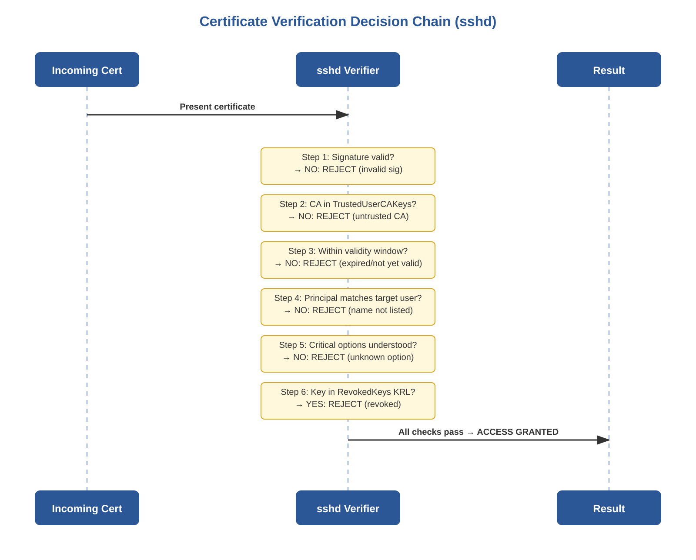
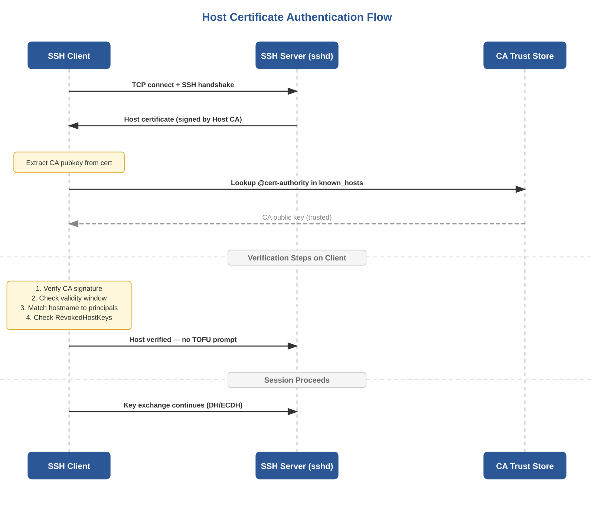
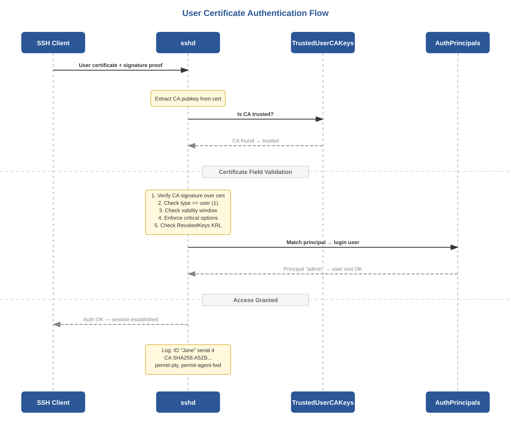
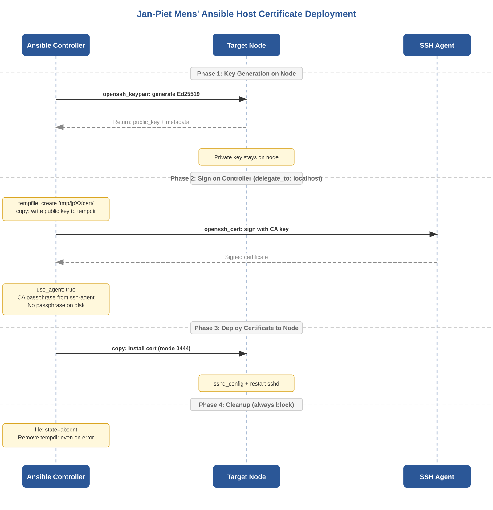

# 1. The Problem: Why SSH Keys Alone Do Not Scale

Traditional SSH public-key authentication operates on a pairwise trust model. On the server side, each user's public key must be present in the target account's authorized\_keys file. On the client side, each server's host key fingerprint must be accepted and stored in known\_hosts. This creates two distinct scaling problems that compound as infrastructure grows.

## The authorized\_keys Problem (User → Server Trust)

Every user--server pair requires explicit key distribution. For N users and M servers, this is an O(N×M) management surface. Onboarding a new user means touching every server; offboarding means hunting down every authorized\_keys entry across the fleet. Key rotation requires the same O(N×M) operation. In practice, keys are almost never rotated, and departed employees' keys linger on servers indefinitely.

## The known\_hosts Problem (Client → Server Trust / TOFU)

When an SSH client connects to a server for the first time, it has no prior knowledge of the server's identity. The user is presented with a fingerprint and asked to confirm: \"Are you sure you want to continue connecting?\" This Trust On First Use (TOFU) model is fundamentally insecure: most users accept without verification, and the first connection is vulnerable to man-in-the-middle attacks. Furthermore, when a server's host key changes legitimately (OS reinstall, key rotation), every client that has cached the old fingerprint must manually update known\_hosts --- or, more commonly, ignore the warning.

SSH certificates solve both problems by introducing a hierarchical trust model based on a Certificate Authority (CA). Servers trust the CA for user authentication; clients trust the CA for host authentication. The management surface becomes O(N+M) instead of O(N×M).

# 2. OpenSSH Certificate Format Internals

OpenSSH certificates are not X.509 certificates. The OpenSSH project deliberately chose a simpler format documented in the PROTOCOL.certkeys file in the OpenSSH source tree. This design decision was motivated by three concerns: (1) X.509 is needlessly complex for SSH's use case, (2) the SSH wire format already defines serialisation for all the data types needed, and (3) no certificate chains are required --- a flat trust model (CA signs end-entity directly) is sufficient for SSH.

An OpenSSH certificate is encoded as a standard SSH public key blob with a certificate-specific type suffix. For example, an Ed25519 user certificate uses the type string ssh-ed25519-cert-v01\@openssh.com. The blob contains the following fields, serialised in order:

  ------------------ ---------------------- ----------------------------------------------------------------------------------------------------------
  **Field**          **Wire Type**          **Semantics**
  nonce              string (random)        Random bytes generated at signing time. Prevents chosen-prefix attacks on the CA signature.
  (public key)       algorithm-specific     The subject's public key, serialised identically to a plain SSH public key.
  serial             uint64                 Administrator-assigned monotonic number. Used for audit trails and KRL-based revocation by serial range.
  type               uint32                 Certificate type: 1 = user certificate, 2 = host certificate. Mixing types is a hard error.
  key id             string                 Free-form identifier logged by sshd on every authentication event. Used for audit trail correlation.
  valid principals   string list            For user certs: Unix usernames. For host certs: hostnames/IPs. Empty list = valid for all (dangerous).
  valid after        uint64                 Unix timestamp: certificate is invalid before this time. Requires NTP synchronisation.
  valid before       uint64                 Unix timestamp: certificate is invalid after this time. Value 0 = no expiry (not recommended).
  critical options   map\<string,string\>   Restrictions that MUST be understood by sshd. Unknown critical options cause rejection.
  extensions         map\<string,string\>   Permissions granted (permit-pty, permit-agent-forwarding, etc). Absent = denied.
  reserved           string                 Currently empty. Reserved for future protocol versions.
  signature key      string                 The CA's public key, embedded in the certificate for self-contained verification.
  signature          string                 Digital signature over ALL preceding fields. The core cryptographic binding.
  ------------------ ---------------------- ----------------------------------------------------------------------------------------------------------

**Critical design observation:** the CA public key is embedded inside the certificate itself. This means the verifier does not need to separately look up which CA signed the certificate --- it extracts the CA key from the cert and then checks whether that key is in its trust store. This is simpler than X.509's issuer-based lookup and eliminates the need for certificate chains.

# 3. Certificate Verification: The Six-Step Chain

When sshd receives a user certificate during public-key authentication, it executes a strict sequence of checks. If any check fails, authentication is rejected and the failure reason is logged. Understanding this chain is essential for troubleshooting.



*Figure 1 --- Certificate verification decision chain in sshd*

## Step 1: Cryptographic Signature Verification

sshd reconstructs the to-be-signed byte sequence from the certificate (everything from the type string through the reserved field) and verifies the signature using the CA public key embedded in the certificate. If the signature is invalid, the certificate has been tampered with or was not signed by the claimed CA. This check is computationally cheap (especially for Ed25519) and is performed first as a fast reject.

## Step 2: CA Trust Lookup

sshd extracts the CA public key from the certificate and searches for it in the file specified by TrustedUserCAKeys. If the key is not found, the CA is untrusted and the certificate is rejected. This is the trust anchor: only CAs whose public keys are explicitly listed are accepted.

## Step 3: Temporal Validity

The current system time must fall within \[valid\_after, valid\_before\]. This is where clock skew becomes fatal: a server whose clock is ahead of the CA's clock may see a freshly signed certificate as \"not yet valid\"; a server whose clock is behind may accept expired certificates. NTP synchronisation is a hard prerequisite.

## Step 4: Principal Matching

The target login username must appear either (a) directly in the certificate's principals list, or (b) in the AuthorizedPrincipalsFile for the target user. If neither matches, the error logged is: \"Certificate invalid: name is not a listed principal\" --- the exact diagnostic Jan-Piet Mens demonstrates when attempting to login as 'ansible' with a certificate that only lists 'jane' as a principal.

## Step 5: Critical Options Enforcement

If the certificate contains critical options (force-command, source-address), they are enforced unconditionally. If a critical option is present that sshd does not understand, the certificate is rejected entirely. This is the semantic difference between critical options and extensions: unknown extensions are silently ignored; unknown critical options are fatal.

## Step 6: Revocation Check

If RevokedKeys is configured in sshd\_config, the certificate's underlying public key and serial number are checked against the Key Revocation List (KRL). If found, sshd logs \"Authentication key \... revoked by file /etc/ssh/revoked\" and falls back to the next authentication method (or denies access if no methods remain).

# 4. Host Certificates: Eliminating TOFU

Host certificates invert the server-identity problem: instead of each client independently deciding whether to trust each server (TOFU), a single CA vouches for all servers. Every client trusts the CA once, and all properly-signed hosts are accepted automatically.



*Figure 2 --- Host certificate authentication flow*

## 4.1 Signing a Host Key

Obtain the server's public host key, then sign it with the Host CA using the -h flag. The -n flag specifies the hostnames and IP addresses the certificate is valid for (the principals). These are the identities the client will match against the connection target:

```
# Copy the server's Ed25519 public host key to the CA machine
scp root@server:/etc/ssh/ssh_host_ed25519_key.pub ./

# Sign with the Host CA (note -h for host type)
ssh-keygen -h -s CA/ssh-host-ca \
  -I "server.example.com-2026" \
  -z 1000 \
  -V +52w \
  -n server.example.com,192.0.2.141 \
  ssh_host_ed25519_key.pub

# Result: ssh_host_ed25519_key-cert.pub
# Type: ssh-ed25519-cert-v01@openssh.com host certificate
```

## 4.2 Server-Side Deployment (sshd\_config)

The signed certificate is installed alongside the host key on the server. sshd is configured to present it during key exchange:

```
# /etc/ssh/sshd_config
HostKey /etc/ssh/ssh_host_ed25519_key
HostCertificate /etc/ssh/ssh_host_ed25519_key-cert.pub

# Also install the User CA public key for user cert auth (Section 5)
TrustedUserCAKeys /etc/ssh/ssh-user-ca.pub
```

## 4.3 Client-Side Trust (\@cert-authority in known\_hosts)

Clients trust the Host CA by adding a \@cert-authority entry to known\_hosts. The hostname pattern restricts which connections this CA is trusted for:

```
# Trust for specific domain (recommended)
@cert-authority *.example.com ssh-ed25519 AAAAC3Nz...

# Trust for specific domain + IP ranges
@cert-authority *.example.com,192.0.2.* ecdsa-sha2-nistp256 AAAAE2...

# System-wide (all clients):
# /etc/ssh/ssh_known_hosts or via ssh_config GlobalKnownHostsFile
```

**Mens' known\_hosts entry:** In his blog, Jan-Piet Mens shows the entry format he uses, including both hostname globs and IP ranges in the same line, ensuring that connections by hostname and by IP both match the CA trust entry. This is a common pitfall: if known\_hosts has \@cert-authority \*.example.com but the user connects via ssh 192.0.2.65, the pattern does not match and the certificate is rejected.

# 5. User Certificates: Eliminating authorized\_keys



*Figure 3 --- User certificate authentication flow with AuthorizedPrincipalsFile*

## 5.1 Signing a User Key

The user generates a standard SSH key pair. The administrator signs the user's public key with the User CA. Mens demonstrates two levels of control: a basic signing with default extensions, and a hardened signing with -O clear to whitelist capabilities:

**Basic signing (all default extensions)**

```
ssh-keygen -s CA/ssh-user-ca \
  -I "Jane Jolie" \
  -n jane \
  -z 1 \
  -V +1w \
  jane.pub
```

This produces a certificate with all default extensions enabled: permit-X11-forwarding, permit-agent-forwarding, permit-port-forwarding, permit-pty, permit-user-rc.

**Hardened signing (explicit whitelist via -O clear)**

```
ssh-keygen -s CA/ssh-user-ca \
  -I "Jane Jolie" \
  -n jane,root \
  -z 4 \
  -V +1w \
  -O clear \
  -O extension:permit-agent-forwarding \
  -O extension:permit-port-forwarding \
  jane.pub
```

**Key insight from Mens:** because permit-pty is NOT in the whitelist, Jane can execute remote commands (ssh jane\@host uname) but cannot get an interactive shell. Attempting it yields \"PTY allocation request failed on channel 0\". This is least-privilege enforcement baked into the certificate itself --- the server does not need any per-user configuration for this.

## 5.2 Critical Options: force-command and source-address

Mens demonstrates two powerful critical options that constrain what a certificate holder can do:

```
# Force a specific command (user cannot override)
ssh-keygen -s CA/ssh-ca -I "Jane" -n jane -z 2 -V +1w \
  -O force-command=/usr/bin/date jane.pub

# User runs 'ssh jane@host uname' but gets 'date' instead:
# Fri Mar 27 13:43:58 UTC 2026

# Restrict source IP (logged when violated)
ssh-keygen -s CA/ssh-ca -I "Jane" -n jane -z 3 -V +1w \
  -O force-command=/usr/bin/date \
  -O source-address=192.0.2.0/24 jane.pub

# sshd log when connecting from wrong IP:
# cert: Authentication tried for jane with valid certificate
# but not from a permitted source address (192.168.1.100).
```

## 5.3 Extensions Reference

  --------------------------------- ----------- ----------------------------------------------- -----------------------------------
  **Extension / Critical Option**   **Type**    **Effect When Present**                         **Effect When Absent**
  permit-pty                        Extension   Interactive shell allowed                       \"PTY allocation request failed\"
  permit-agent-forwarding           Extension   ssh-agent forwarding allowed                    Agent forwarding silently blocked
  permit-port-forwarding            Extension   TCP port forwarding allowed                     Port forwarding blocked
  permit-X11-forwarding             Extension   X11 forwarding allowed                          X11 forwarding blocked
  permit-user-rc                    Extension   \~/.ssh/rc executed on login                    rc file skipped
  force-command=cmd                 Critical    Only cmd executes, regardless of user request   Any command allowed
  source-address=CIDR               Critical    Login restricted to specified networks          Any source IP accepted
  --------------------------------- ----------- ----------------------------------------------- -----------------------------------

## 5.4 AuthorizedPrincipalsFile: Role-Based Access

Without AuthorizedPrincipalsFile, principal matching is direct: a certificate with -n jane can only log in as user jane. AuthorizedPrincipalsFile introduces an indirection that enables role-based access control (RBAC):

```
# /etc/ssh/sshd_config
AuthorizedPrincipalsFile /etc/ssh/auth_principals/%u

# /etc/ssh/auth_principals/root    (who can login as root?)
admin
root-everywhere

# /etc/ssh/auth_principals/deploy  (who can login as deploy?)
deployer
zone-webservers
```

A certificate signed with -n admin can now log in as root, because \"admin\" appears in /etc/ssh/auth\_principals/root. The certificate encodes the user's roles; each server independently maps roles to local accounts. Adding a new server only requires creating the appropriate principal files --- no re-signing of certificates.

# 6. Client-Side Certificate Usage

## 6.1 Auto-Discovery

SSH automatically discovers certificates by naming convention: if the private key is \~/.ssh/id\_ed25519, SSH looks for \~/.ssh/id\_ed25519-cert.pub. No configuration is needed if this convention is followed.

## 6.2 SSH Agent Integration

Mens shows that ssh-add loads both the key and its certificate into the agent:

```
$ ssh-add jane
Enter passphrase for jane:
Identity added: jane (Jane's key)
Certificate added: jane-cert.pub (Jane Jolie)

$ ssh-add -l
256 SHA256:2WH2...u/KE Jane's key (ECDSA)
256 SHA256:2WH2...u/KE Jane's key (ECDSA-CERT)
```

Both the key and the certificate are listed. They must both be removed with ssh-add -d if needed. This is relevant for troubleshooting: a stale certificate in the agent can cause unexpected authentication failures.

## 6.3 Explicit Configuration in ssh\_config

```
# ~/.ssh/config
Host *.example.com
  IdentityFile ~/.ssh/id_ed25519
  CertificateFile ~/.ssh/id_ed25519-cert.pub
  IdentitiesOnly yes
```

# 7. Revocation and Key Revocation Lists (KRL)

Short-lived certificates (hours/days) naturally limit the revocation window: a compromised key becomes useless when the certificate expires. For immediate revocation, OpenSSH provides Key Revocation Lists (KRLs).

## 7.1 Creating and Updating KRLs

Mens demonstrates the basic KRL workflow:

```
# Create KRL revoking a specific key
ssh-keygen -k -f /etc/ssh/revoked jane.pub

# Install on target and configure sshd:
install -m444 revoked /etc/ssh/revoked
# sshd_config: RevokedKeys /etc/ssh/revoked
sshd -t && systemctl restart sshd

# Result when Jane connects:
# sshd log: error: Authentication key ECDSA-CERT
#   SHA256:2WH2...u/KE revoked by file /etc/ssh/revoked
```

**Security note:** KRL files are NOT signed. Any process with write access to the KRL can modify revocation state. Protect with strict permissions (0444, root-owned). Mens explicitly warns about this.

# 8. Audit Trail

Certificate-based auth produces rich, structured logs that identify the actual human behind any connection --- even when logging into shared accounts like root:

```
Apr 02 10:22:07 d13 sshd-session[1058]:
  Accepted publickey for root from 192.0.2.140 port 54872
  ssh2: ECDSA-CERT SHA256:2WH2...u/KE
  ID Jane Jolie (serial 4)
  CA ECDSA SHA256:A5ZB...pamM
```

This log entry, taken directly from Mens' blog, contains: the target user (root), source IP, certificate type and fingerprint, the Key ID (\"Jane Jolie\") set during signing, the serial number (4), and the CA fingerprint. The Key ID is the critical field: it ties the session back to a named human even through shared accounts.

# 9. Building the Certificate Authority

## 9.1 Dual-CA Architecture

Best practice is to maintain two separate CA key pairs: one for signing user certificates, another for signing host certificates. This separation limits blast radius: a compromised user CA cannot forge host identities (no MITM), and a compromised host CA cannot forge user identities (no unauthorized access). Mens uses a single CA for simplicity in his demos but notes the separation principle.

```
ssh-keygen -t ecdsa -b 256 -f CA/ssh-user-ca -C "User CA"
ssh-keygen -t ecdsa -b 256 -f CA/ssh-host-ca -C "Host CA"
```

## 9.2 Algorithm Selection: ECDSA nistp256

Mens uses ECDSA nistp256 for his CA (fingerprint: ECDSA SHA256:A5ZBb5b/\...) and this is the algorithm we follow throughout this document. ECDSA nistp256 provides 128-bit security, is universally supported across all OpenSSH versions since 5.7, and --- critically --- has full PKCS\#11 v2.40 support, making it compatible with hardware security modules (HSMs) and key management systems such as Cosmian KMS that expose keys via PKCS\#11. RSA is discouraged for new CAs due to key size overhead and the historical sha1 signature weakness.

**Note on Ed25519:** Ed25519 is an excellent choice for end-entity keys (host keys, user keys) --- Mens generates Ed25519 host keys on nodes in his Ansible playbook. However, the CA key is a different concern: it must be compatible with the signing infrastructure. PKCS\#11 v2.40 does not define Ed25519 (CKM\_EDDSA was introduced in PKCS\#11 v3.0), so an Ed25519 CA key cannot be stored in or used from most PKCS\#11-backed key stores. Using ECDSA nistp256 for the CA keeps this door open while losing nothing in security level.

## 9.3 CA Private Key Protection

The CA private key is the single most critical secret in this architecture. Mens demonstrates use of passphrase-protected keys with ssh-agent via the use\_agent: true option in Ansible's openssh\_cert module --- the passphrase is entered once into the agent, and signing operations use the agent without exposing the key material.

-   Passphrase encryption: minimum baseline. ssh-keygen prompts at signing time.

-   SSH Agent: load the passphrase-encrypted CA key into the agent once per session. This is Mens' approach in his Ansible workflow.

-   PKCS\#11 key management system (e.g., Cosmian KMS): the CA private key is stored in the KMS and accessed via the PKCS\#11 provider library. ssh-add -s /path/to/cosmian\_pkcs11.so loads it into the agent, or ssh-keygen -D can use it directly. The key never exists as a file on disk. See Section 10.5 for the Cosmian KMS integration workflow.

-   FIDO2/hardware tokens: ssh-keygen -U stores the key on a hardware device (YubiKey). The key never exists in software.

-   Air-gapped machine: CA key exists only on a dedicated offline machine brought online solely for signing ceremonies.

# 10. Automation: Jan-Piet Mens' Ansible Approach

## 10.1 Design Philosophy

Jan-Piet Mens is an independent Unix/Linux consultant who has worked with Unix systems since 1985, contributed the documentation system and multiple modules to the Ansible project, and authored several technical publications. His approach to SSH certificate automation reflects his overall philosophy: use existing tools, avoid unnecessary complexity, and keep implementations understandable by a single sysadmin.

In his April 7, 2026 blog post, Mens presents a concrete Ansible playbook for deploying SSH host keys and certificates. The key design decisions are:

-   **Private key generation on the node:** the Ed25519 private key is generated directly on the target node using community.crypto.openssh\_keypair. The private key never leaves the node --- it is never transmitted over the network, not even to the Ansible controller.

-   **Signing on the controller via delegation:** only the public key is copied to the controller (via the module's returned metadata), signed locally using community.crypto.openssh\_cert, and the resulting certificate is pushed back to the node.

-   **CA key in SSH agent:** the CA private key is passphrase-encrypted. Rather than storing the passphrase in Ansible Vault or on disk, Mens loads it into his SSH agent and uses use\_agent: true in the openssh\_cert module. The passphrase exists only in agent memory.

-   **Temporary directory with block/always cleanup:** signing artifacts (public key copy, certificate) are written to a uniquely-named tempdir (/tmp/jpXXXcert/), and the always block ensures this directory is removed even if the signing step fails.



*Figure 4 --- Jan-Piet Mens' Ansible host certificate deployment workflow*

## 10.2 The Complete Playbook (Annotated)

The following is Mens' actual playbook from his April 7, 2026 blog post, with inline annotations explaining each design decision:

```
- hosts: d13
  gather_facts: yes                  # Need ansible_fqdn, ansible_all_ipv4_addresses
  remote_user: jp
  vars:
     dirname: "/etc/ssh"
  tasks:

    # ── PHASE 1: Generate key ON THE NODE ──
    # Private key never leaves the target machine.
    # opensshbin backend = use the node's ssh-keygen binary.
    - name: Generate ED25519 SSH host key on node
      community.crypto.openssh_keypair:
         backend: "opensshbin"
         path: "{{ dirname }}/ssh_host_ed25519_key"
         comment: "ansible-made™ for host {{ inventory_hostname }}"
         type: "ed25519"
      become: true
      register: keydata

    - debug: var=keydata

    # ── PHASE 2-4 in block/always for cleanup ──
    - block:

        # Create isolated tempdir on controller
        - name: Create a local temporary directory
          ansible.builtin.tempfile:
                   prefix: "jp"
                   suffix: "cert"
                   state: directory
          register: p
          delegate_to: localhost

        # Write ONLY the public key to controller
        # Sourced from keydata.public_key (returned metadata)
        - name: Save public host key to local temporary file
          ansible.builtin.copy:
              content: "{{ keydata.public_key }}"
              dest: "{{ p.path }}/{{ keydata.filename | basename }}"
          delegate_to: localhost

        # ── SIGN on controller using SSH agent ──
        # principals = FQDN + ALL IPv4 addresses on the node
        # use_agent: true = CA passphrase from ssh-agent, never on disk
        - name: Sign SSH certificate on local copy of public host key
          community.crypto.openssh_cert:
             identifier: "{{ inventory_hostname }}"
             public_key: "{{ p.path }}/{{ keydata.filename | basename }}"
             principals:
               "{{ [ ansible_fqdn ] + ansible_all_ipv4_addresses }}"
             path: "{{ p.path }}/{{ keydata.filename | basename }}-cert.pub"
             serial_number: 10
             signing_key: "../CA/ssh-ca"
             use_agent: true
             type: "host"
             valid_from: "+0m"
             valid_to: "+53w"
          delegate_to: localhost

        # ── Push certificate back to node ──
        - name: Install signed certificate on target node
          ansible.builtin.copy:
             src: "{{ p.path }}/{{ keydata.filename | basename }}-cert.pub"
             dest: "{{ dirname }}"
             mode: 0444
          become: true

      # ── CLEANUP: always runs, even on error ──
      always:
        - name: Remove local temporary directory
          ansible.builtin.file:
              path: "{{ p.path }}"
              state: absent
          delegate_to: localhost
```

## 10.3 Analysis of Key Design Decisions

### 10.3.1 Why openssh\_keypair on the Node (Not the Controller)

Generating the private key on the node itself means the key material never traverses the network. If the Ansible controller were compromised, the attacker would have certificates (which expire) but not the persistent private keys of the nodes. This is a deliberate separation of concerns: the controller holds signing authority (time-limited), nodes hold identity (persistent).

### 10.3.2 Why use\_agent: true

The openssh\_cert module supports three methods of accessing the CA private key: plaintext passphrase on disk, Ansible Vault-encrypted passphrase, or SSH agent. Mens chooses the agent because it eliminates all passphrase storage: the CA key is loaded into the agent once (ssh-add CA/ssh-ca), and subsequent signing operations reference the agent. If the playbook is interrupted, no passphrase artifacts remain on disk.

### 10.3.3 Why block/always with tempfile

The public key and signed certificate are written to a uniquely-named temporary directory (/tmp/jpXXXcert/) on the controller. The always block ensures this directory is removed even if signing fails mid-playbook. Without this, repeated failed runs could leave public key material scattered across /tmp. The tempfile module's prefix/suffix ensure unique naming across concurrent runs.

### 10.3.4 The principals Expression

The expression {{ \[ ansible\_fqdn \] + ansible\_all\_ipv4\_addresses }} constructs a principals list containing the node's fully-qualified domain name plus every IPv4 address on the node. This ensures the host certificate is valid regardless of whether clients connect by hostname or by IP. Mens notes in his earlier post that connecting by IP when the cert only lists the FQDN will fail --- this principals expression prevents that pitfall.

### 10.3.5 The keydata Metadata Pattern

The openssh\_keypair module returns structured metadata in its register variable, including public\_key (the full public key string) and filename (the path on the remote node). Mens uses keydata.filename \| basename to extract just the filename component, making the playbook path-independent. The debug task is deliberately left in so operators can verify what was generated:

```
"keydata": {
    "changed": true,
    "comment": "ansible-made™ for host d13",
    "filename": "/etc/ssh/ssh_host_ed25519_key",
    "fingerprint": "SHA256:3zm2UIy...2Y",
    "public_key": "ssh-ed25519 AAAAC3NzaC1lZDI1NTE5AAAA...",
    "size": 256,
    "type": "ed25519"
}
```

## 10.4 What Mens Leaves as \"An Exercise\"

Mens deliberately omits two steps from his playbook, noting they \"ought to be simple enough\":

-   **sshd\_config modification:** adding HostCertificate and TrustedUserCAKeys directives. This can be done with ansible.builtin.blockinfile or ansible.builtin.lineinfile.

-   **sshd restart via handler:** a notify/handler pair that restarts sshd only when configuration or certificate files change.

A production-complete extension of his playbook would add:

```
    - name: Configure sshd for certificates
      ansible.builtin.blockinfile:
        path: /etc/ssh/sshd_config
        marker: "# {mark} ANSIBLE SSH CERTIFICATES"
        block: |
          HostCertificate /etc/ssh/ssh_host_ed25519_key-cert.pub
          TrustedUserCAKeys /etc/ssh/ssh-user-ca.pub
      become: true
      notify: restart sshd

    - name: Validate sshd config before restart
      ansible.builtin.command: sshd -t
      become: true
      changed_when: false

  handlers:
    - name: restart sshd
      ansible.builtin.service:
        name: sshd
        state: restarted
      become: true
```

## 10.5 Integration with Cosmian KMS

Cosmian KMS (v5.20.1) is a FIPS 140-3 compliant key management system that lists OpenSSH as a supported integration. It ships a PKCS\#11 provider library (libcosmian\_pkcs11.so) that exposes keys stored in the KMS to any PKCS\#11-consuming application, including OpenSSH. Since v5.19.0, the PKCS\#11 module includes specific fixes for OpenSSH compatibility: correct EC point encoding per PKCS\#11 v2.40, proper SPKI public-key extraction for RSA and EC, and stability under OpenSSH key enumeration patterns.

Because our CA is ECDSA nistp256 (Section 9.2), it fits entirely within the PKCS\#11 v2.40 mechanism set that Cosmian's module implements. The integration requires no changes to sshd configuration, known\_hosts, or the certificate verification chain --- only the CA key storage and signing step change.

### 10.5.1 Setup: CA Key in Cosmian KMS

```
# Generate ECDSA CA key pair inside Cosmian KMS (non-exportable)
cosmian kms ec keys create --curve nist-p256 \
  --tag ssh-ca --tag host-signing --sensitive true ssh-ca-key

# Or import an existing ECDSA CA key:
cosmian kms ec keys import --key-format pkcs8 --tag ssh-ca CA/ssh-ca

# Configure the PKCS#11 module on the Ansible controller:
# /etc/cosmian/cosmian.toml
[kms_config.http_config]
server_url = "https://kms.example.com:9998"
ssl_client_pkcs12_path = "./certificates/controller.p12"
ssl_client_pkcs12_password = "p12_password"

# Register the module with p11-kit:
sudo tee /etc/pkcs11/modules/cosmian_pkcs11.module <<EOF
module: /usr/local/lib/libcosmian_pkcs11.so
EOF
```

### 10.5.2 Loading into ssh-agent (Mens' Playbook Compatible)

The cleanest integration path is loading the Cosmian PKCS\#11 module into the SSH agent. This makes the KMS-stored CA key available to ssh-keygen and to Ansible's openssh\_cert module with use\_agent: true --- Mens' playbook works unmodified:

```
# Load Cosmian KMS keys into ssh-agent via PKCS#11
ssh-add -s /usr/local/lib/libcosmian_pkcs11.so

# Verify the CA key is visible
ssh-add -l
# 256 SHA256:A5ZB... Cosmian-KMS (ECDSA)

# Now Mens' playbook works as-is:
# community.crypto.openssh_cert with use_agent: true
# signs via the agent, which delegates to Cosmian KMS
```

Alternatively, ssh-keygen can use the PKCS\#11 module directly without the agent:

```
# Direct PKCS#11 signing (no agent needed)
ssh-keygen -D /usr/local/lib/libcosmian_pkcs11.so \
  -s CA/ssh-ca.pub \
  -h -I "server.example.com" \
  -n server.example.com,10.0.1.50 \
  -V +52w \
  ssh_host_ed25519_key.pub
```

### 10.5.3 What This Gains Over Mens' Baseline

In Mens' original workflow, the CA private key is a passphrase-encrypted file on the controller's filesystem, loaded into ssh-agent memory. With Cosmian KMS:

-   **The CA private key never exists as a file on disk.** It is generated inside (or imported into) the KMS and never exported. The PKCS\#11 module sends signing requests to the KMS server; the key material stays server-side.

-   **Access control and audit.** Cosmian KMS provides per-user access-rights (cosmian kms access-rights grant), OIDC/certificate authentication, and audit logging of every signing operation --- which the CA private key on disk cannot provide.

-   **HSM backing.** Cosmian KMS can wrap keys with a hardware security module (Utimaco, SmartCard-HSM/Nitrokey HSM 2, Proteccio). The CA key is protected by hardware even at the KMS level.

-   **No controller compromise escalation.** If the Ansible controller is compromised, the attacker cannot extract the CA key --- it does not exist on the controller. They could sign certificates only while the agent session is active, which is time-bounded. With a file-based CA key, a controller compromise yields the key permanently.

# 11. Troubleshooting Checklist

Compiled from Mens' blog posts, sshd\_config(5), and operational experience:

  ----------------------------------------- ------------------------------------------------------------------- -------------------------------------------------------------------------------
  **Symptom**                               **Likely Cause**                                                    **Diagnostic / Fix**
  TOFU prompt despite host cert             Certificate expired, or \@cert-authority pattern mismatch           ssh-keygen -L -f cert shows validity. Check hostname pattern in known\_hosts.
  \"Certificate invalid: expired\"          Certificate's valid\_before has passed                              Re-sign with new -V window. Check NTP on server.
  \"name is not a listed principal\"        Login username not in cert principals or AuthorizedPrincipalsFile   ssh-keygen -L shows principals. Check /etc/ssh/auth\_principals/%u.
  \"PTY allocation request failed\"         permit-pty not in certificate extensions                            Re-sign with -O extension:permit-pty or without -O clear.
  \"not from a permitted source address\"   source-address critical option blocks client IP                     Check cert's critical options. Re-sign without source-address.
  \"revoked by file /etc/ssh/revoked\"      Key/cert in RevokedKeys KRL                                         Check with ssh-keygen -Q -f revoked key.pub.
  Agent shows key but not cert              Certificate not adjacent to key, or stale agent                     ssh-add -d key; ssh-add key (reloads both).
  sshd won't start after config change      Syntax error in sshd\_config                                        Always run sshd -t before restarting.
  Clock skew rejection                      Server clock ahead/behind CA clock                                  Deploy NTP. Certificate valid\_after is in server's future.
  ----------------------------------------- ------------------------------------------------------------------- -------------------------------------------------------------------------------

# 12. Configuration Directive Reference

## 12.1 Server-Side (sshd\_config)

  ----------------------------------- -----------------------------------------------------------------------------------------
  **Directive**                       **Purpose**
  TrustedUserCAKeys /path/to/ca.pub   CA public keys trusted to sign user certificates. One key per line.
  AuthorizedPrincipalsFile /path/%u   Per-user file listing principals allowed to login as that user. Supports %u, %h tokens.
  HostCertificate /path/to/cert.pub   Host certificate to present to clients during key exchange.
  RevokedKeys /path/to/krl            KRL file containing revoked user keys/certificates.
  CASignatureAlgorithms algo,\...     Restrict which signature algorithms the CA may use for signing.
  AuthorizedPrincipalsCommand /path   External script to dynamically resolve principals (e.g., LDAP).
  ----------------------------------- -----------------------------------------------------------------------------------------

## 12.2 Client-Side

  ------------------------------ -----------------------------------------------------------------
  **Directive / Syntax**         **Purpose**
  \@cert-authority pattern key   Trust a CA for host certificate verification (in known\_hosts).
  \@revoked key                  Revoke a specific host key (in known\_hosts).
  CertificateFile path           Explicitly specify user certificate file (in ssh\_config).
  RevokedHostKeys /path/to/krl   KRL for revoking host certificates (in ssh\_config).
  GlobalKnownHostsFile /path     System-wide known\_hosts file location.
  ------------------------------ -----------------------------------------------------------------

# 13. Summary: Keys vs. Certificates

  ----------------- ---------------------------------------- ------------------------------------------------------------------------------
  **Dimension**     **Traditional SSH Keys**                 **SSH Certificates**
  Host trust        TOFU: manual fingerprint acceptance      Automatic via \@cert-authority + Host CA
  User trust        authorized\_keys on every server         TrustedUserCAKeys: sign once, access everywhere
  Scaling           O(users × servers)                       O(users + servers)
  Expiry            Keys never expire                        Built-in validity window (hours to weeks)
  Rotation          Update every authorized\_keys            Re-sign certificate; no server-side changes
  RBAC              Not possible                             Principals + AuthorizedPrincipalsFile
  Audit             Key fingerprint only                     Key ID + serial + CA fingerprint in logs
  Least privilege   All-or-nothing                           Per-cert: PTY, forwarding, commands, source IP
  Offboarding       Hunt down every authorized\_keys entry   Certificate expires; or instant via KRL
  Automation        Copy pubkeys (Ansible authorized\_key)   Mens' pattern: generate on node, sign on controller (CA in KMS via PKCS\#11)
  ----------------- ---------------------------------------- ------------------------------------------------------------------------------

# 14. References

-   Jan-Piet Mens, \"SSH certificates: the better SSH experience\", jpmens.net, 3 April 2026

-   Jan-Piet Mens, \"Deploying SSH host keys and certificates with Ansible\", jpmens.net, 7 April 2026

-   OpenSSH source tree: PROTOCOL.certkeys --- certificate wire format specification

-   ssh-keygen(1) manual page --- CERTIFICATES section

-   sshd\_config(5) manual page --- TrustedUserCAKeys, AuthorizedPrincipalsFile, RevokedKeys, CASignatureAlgorithms

-   community.crypto.openssh\_cert Ansible module --- docs.ansible.com

-   community.crypto.openssh\_keypair Ansible module --- docs.ansible.com

-   Facebook Engineering, \"Scalable and secure access with SSH\" (2016)

-   Smallstep SSH --- automated SSH certificate management toolkit

-   Cosmian KMS v5.20.1 --- PKCS\#11 provider with OpenSSH integration (github.com/Cosmian/kms)
